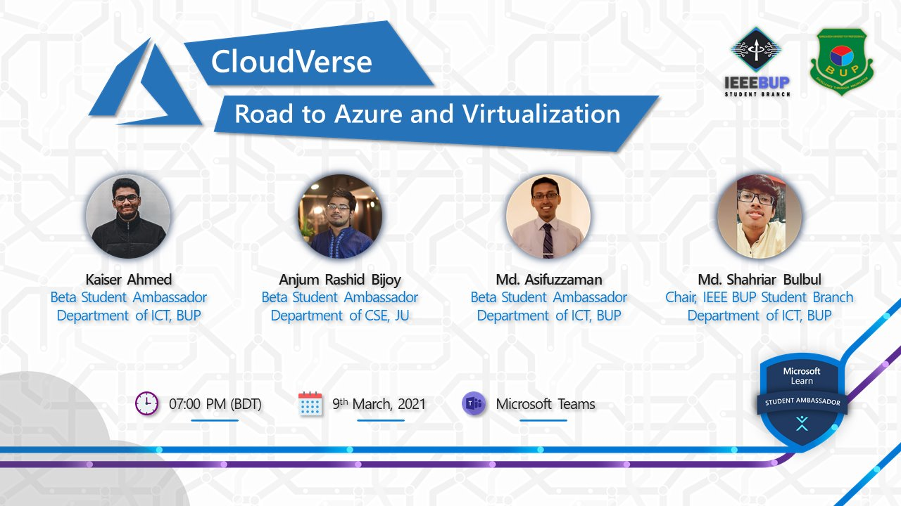

# CloudVerse - Road to Azure and Virtualization
### Explore Virtualization and Cloud Computing with Career Prospects 

 

 

  

 

## :scroll: Event Snippet

In this event, you will learn the basics and functional features of **Virtualization** and **Cloud Computing** with **Microsoft Azure**. 
Also, you will explore the prospects of a career in cloud computing sector.

**This Training Series is covering following topics :** 
- Basics of cloud computing with **Microsoft Azure**
- **Azure Student Account** activation with Edu-mail 
- Virtualization overview 
- Azure data center virtualization
- Live demonstration of **Azure Virtual Machine** provision
- Web servers hosting in Azure
- Career and opportunities in Cloud Computing

## :books: Event Handbook 
### Grab the **Exclusive Handbook** and get started with Azure today!

### The handbook covers- 
* How to activate **Azure for Students** Account
* How to create and access a **Virtual Machine** on Azure 

## 🚀 Learning Resource

Check out [Virtualization - Sharing cloud resources](https://docs.microsoft.com/en-us/learn/paths/cmu-cloud-computing-how-cloud-works) learning path on **Microsoft Learn** for in-depth virtualization insights!

## :movie_camera: Event Recording

[Full Playlist](https://www.youtube.com/playlist?list=PLIQ7u2lvft7zGbp22YGfSrIZW3wpyqHsk) Available on **YouTube**

## :star: Credits
- Organizer Community : [Microsoft Learn Student Ambassadors BUP](https://www.mlsa-bup.technology/)  
- Collaborating Organization : [IEEE BUP Student Branch](https://www.bup.edu.bd/clubs/bup-ieee-student-branch)  
- Speakers : 
	- [Md. Asifuzzaman](https://github.com/asif-uz-zaman) (Ambassador)  
	- [Kaiser Ahmed](https://github.com/mekaiser) (Ambassador)  
	- [Anjum Rashid](https://github.com/bijoy26) (Ambassador)  
	- [Shahriar Bulbul](#) (Guest)  

----
